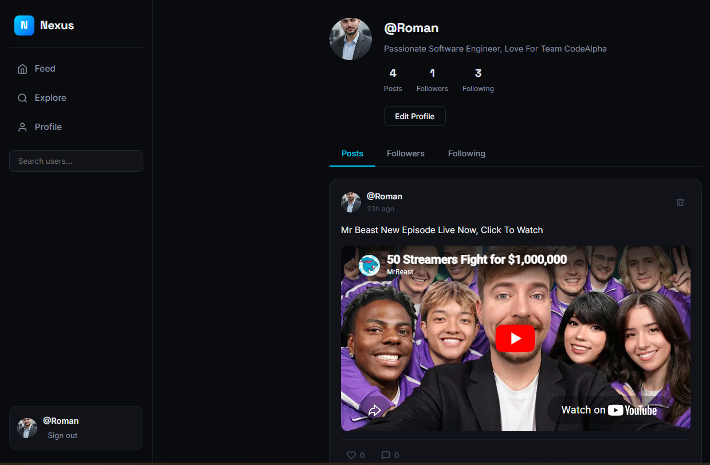

# Nexus Social 🌐

A full-stack mini social media platform built from scratch with Node.js, Express, SQLite, and vanilla JavaScript. No frameworks, no shortcuts — every feature implemented manually.

    

---

## 📸 Preview



> *Feed view showing posts with likes, comments, and real-time interactions*

---

## ✨ Features

### Authentication
- Secure registration and login with username or email
- Password hashing with bcrypt (salt rounds: 10)
- JWT-based session management (7-day expiry)
- Protected routes — unauthorized requests return 401

### Posts
- Create text posts (up to 500 characters)
- Attach images or videos via URL (auto-detects type)
- YouTube and Vimeo embeds supported automatically
- Delete your own posts
- Character counter with warning at 450+

### Social Interactions
- Like and unlike posts (one like per user enforced at DB level)
- Comment on posts with a modal view
- Delete your own comments
- Live like and comment count sync without page reload

### Follow System
- Follow and unfollow any user
- Personalized feed — only shows posts from followed users + your own
- Followers and following lists on every profile
- Self-follow prevention

### Profiles
- Public profile pages for every user
- Posts / Followers / Following tabs
- Edit your own bio and avatar
- Post count, follower count, following count displayed

### Search
- Real-time user search with 300ms debounce
- Results show avatar, username, and bio
- Click any result to navigate directly to their profile

### UI/UX
- Single Page Application — zero page reloads
- Dark space theme with cyan accent
- Fully responsive — sidebar collapses to icons on mobile
- Toast notifications for all actions
- Loading and empty states on every list
- Broken image fallback to username initial

---

## 🛠️ Tech Stack

| Layer | Technology | Purpose |
|---|---|---|
| Runtime | Node.js 18+ | Server-side JavaScript |
| Framework | Express.js 5 | HTTP routing and middleware |
| Database | SQLite via sql.js | Zero-dependency persistent storage |
| Auth | bcryptjs + jsonwebtoken | Password hashing and JWT tokens |
| Frontend | Vanilla HTML/CSS/JS | No framework — pure DOM manipulation |
| Fonts | Google Fonts (Inter + Space Grotesk) | Typography |

---

## 🗄️ Database Schema

| Table | Key Columns |
|---|---|
| users | id, username, email, password (hashed), bio, avatar, created_at |
| posts | id, user_id → users, content, image_url, created_at |
| comments | id, post_id → posts, user_id → users, content, created_at |
| likes | post_id + user_id (UNIQUE — enforces one like per user) |
| follows | follower_id + following_id (UNIQUE — prevents duplicate follows) |

---

## 📁 Project Structure

nexus-social/

├── server.js          # Express server — all 18 API routes

├── database.js        # sql.js SQLite layer — schema + query helpers

├── package.json

├── socialapp.db       # Auto-generated SQLite database (git-ignored)

└── public/

├── index.html     # SPA shell — all screens and modals

├── css/

│   └── style.css  # Complete design system (CSS variables, responsive)

└── js/

├── api.js         # Fetch wrapper — all API calls

├── components.js  # DOM builders — post cards, avatars, comments

└── app.js         # Controller — routing, state, feature logic

---

## 🚀 Getting Started

### Prerequisites
- Node.js v18 or higher
- npm

### Installation

```bash
# Clone the repository
git clone https://github.com/YOUR_USERNAME/nexus-social.git

# Navigate into the project
cd nexus-social

# Install dependencies
npm install

# Start the development server
npm run dev
```

Open your browser at **http://localhost:3000**

---

## 🔌 API Reference

### Auth
| Method | Endpoint | Auth | Description |
|---|---|---|---|
| POST | /api/auth/register | None | Register new user |
| POST | /api/auth/login | None | Login, returns JWT |

### Users
| Method | Endpoint | Auth | Description |
|---|---|---|---|
| GET | /api/users/me | Required | Get logged-in user |
| PUT | /api/users/me | Required | Update bio and avatar |
| GET | /api/users/:username | Optional | Get public profile |
| GET | /api/users/search/:query | Optional | Search users |
| GET | /api/users/:username/posts | Optional | Get user's posts |
| GET | /api/users/:username/followers | None | Get followers list |
| GET | /api/users/:username/following | None | Get following list |

### Follows
| Method | Endpoint | Auth | Description |
|---|---|---|---|
| POST | /api/users/:username/follow | Required | Follow a user |
| DELETE | /api/users/:username/follow | Required | Unfollow a user |

### Posts
| Method | Endpoint | Auth | Description |
|---|---|---|---|
| GET | /api/posts/feed | Required | Personalized feed |
| GET | /api/posts/explore | Optional | All posts, newest first |
| POST | /api/posts | Required | Create post |
| DELETE | /api/posts/:id | Required | Delete own post |

### Likes
| Method | Endpoint | Auth | Description |
|---|---|---|---|
| POST | /api/posts/:id/like | Required | Like a post |
| DELETE | /api/posts/:id/like | Required | Unlike a post |

### Comments
| Method | Endpoint | Auth | Description |
|---|---|---|---|
| GET | /api/posts/:id/comments | None | Get comments |
| POST | /api/posts/:id/comments | Required | Add comment |
| DELETE | /api/comments/:id | Required | Delete own comment |

---

## 🔐 Security Implementation

- Passwords never stored in plain text — bcrypt with 10 salt rounds
- JWT tokens expire after 7 days
- `authRequired` middleware blocks all protected routes without valid token
- `authOptional` middleware allows guests to read but not write
- UNIQUE constraints at DB level prevent duplicate likes and follows
- User-generated content rendered with `textContent` (not `innerHTML`) — XSS safe
- Post ownership verified server-side before delete — not just client-side

---

## 📐 Architecture Decisions

**Why sql.js instead of better-sqlite3?**
sql.js is pure JavaScript — no native C++ compilation required. This means the project runs on any machine without build tools, which matters for team projects and CI pipelines.

**Why vanilla JS instead of React?**
This project was built to demonstrate deep understanding of the DOM, event handling, and state management without framework abstraction. Every component is a plain function that returns a DOM element.

**Why a SPA without a router library?**
The routing logic is simple enough to implement manually with `display: none / block` toggling and a `navigateTo()` function. Adding a library for three views would be over-engineering.

**Why JWT in localStorage vs cookies?**
For a learning project, localStorage JWT is simpler to understand and debug. In production, HttpOnly cookies are more secure against XSS attacks.

---

## 🚧 Roadmap

- [ ] Image file uploads (multer middleware)
- [ ] Real-time notifications (WebSockets)
- [ ] Infinite scroll with offset pagination
- [ ] Post hashtags and filtering
- [ ] Direct messages
- [ ] Deploy to Railway / Render
- [ ] Swap SQLite → PostgreSQL for production
- [ ] JWT refresh token rotation

---

## 👨‍💻 Author

**Roman Khan**
Software Engineering Student — City University of Science & IT, Peshawar (2023–2027)

[](https://github.com/YOUR_USERNAME)
[](https://linkedin.com/in/YOUR_PROFILE)

---

## 📄 License

MIT License — free to use, modify, and distribute.